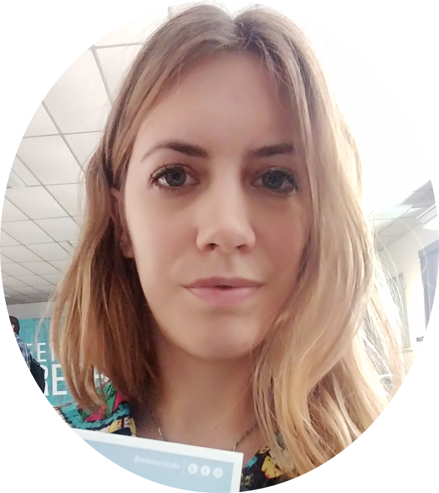

```{r, include=FALSE}
knitr::opts_chunk$set(
  results='asis', 
  echo = FALSE
)

library(glue)
library(tidyverse)

# ======================================================================
# These variables determine how the the data is loaded and how the exports are
# done.

# Is data stored in google sheets? If no data will be gather from the csvs/
# folder in project
using_googlesheets <- TRUE

# Just the copied URL from the sheet
positions_sheet_loc <- "https://docs.google.com/spreadsheets/d/1FWE8f8Ej4xd5Q-iasiR92Y3_zzGDvVc27nhpx8et_Ro/edit#gid=1663640807"

# Is this sheet available for anyone to read? If you're using a private sheet
# set this to false and go to gather_data.R and run the data loading manually
# once to cache authentication
sheet_is_publicly_readable <- TRUE

# Is the goal of this knit to build a document that is exported to PDF? If so
# set this to true to have links turned into footnotes at the end of the
# document
PDF_EXPORT <- F


# A global (gasp) variable that holds all the links that were inserted for
# placement at the end
links <- c()

# ======================================================================
# Now we source two external scripts. One contains functions for building the
# text output and the other loads up our data from either googlesheets or csvs

# Functions for building sections from CSV data
source('parsing_functions.R') 

# Load data for CV/Resume
source('gather_data.R')
```


Aside
================================================================================


{width=80%}

Contact {#contact}
--------------------------------------------------------------------------------

```{r}
contact_info %>% 
  glue_data("- <i class='fa fa-{icon}'></i> {contact}")
```


Disclaimer {#disclaimer}
--------------------------------------------------------------------------------

Made with the R package [**pagedown**](https://github.com/rstudio/pagedown) and [**datadrivencv**](http://nickstrayer.me/datadrivencv/index.html)

Last updated on `r Sys.Date()`.

Main
================================================================================

Gisela Soledad Gualdoni {#title}
--------------------------------------------------------------------------------

```{r, eval = FALSE}
# change eval to true when intro is written
print_text_block(text_blocks, 'intro')
```

Current position {data-icon=user data-concise=true}
--------------------------------------------------------------------------------

```{r}
print_section(position_data, "ACTUAL_POSITION")
```


Education {data-icon=graduation-cap data-concise=true}
--------------------------------------------------------------------------------

```{r}
print_section(position_data, "education")
```


Postgraduate courses {data-icon=laptop}
--------------------------------------------------------------------------------

```{r}
print_section(position_data, 'posgraduate_courses')
```
::: aside

### Technical Skills {#skills}

- **Histology techniques:** (paraffin, cryostat)

- **Immunohistochemistry:** IP, IF, TUNEL

- **Histopathology**

- **Morphometric analysis (Image J, Adobe Photoshop)** 

- **RT-PCR** 

- **Western Blot** 

- **ELISA** 

- **Enzymatic zymography**

- **Oxidative stress techniques** 

- **Animal handling (mouse, rat)** 

- **Cell culture (testicular explants)** 

:::

Research projects and activities {data-icon=tasks}
--------------------------------------------------------------------------------

```{r}
print_section(position_data, 'RESEARCH_PROJECTS')
```

Publications {data-icon=file}
--------------------------------------------------------------------------------

::: aside

### Languages {#languages}

- **Spanish:** Native 

- **English:** Upper Intermediate 

:::

```{r}
print_section(position_data, 'publications')
```


Grants, Awards and Fellowships {data-icon=trophy}
--------------------------------------------------------------------------------

```{r}
print_section(position_data, 'GRANTS_FELLOWSHIPS')
```

<!-- These breaks just force a new page so section doesnt get cut off -->
<!--<br>-->


Selected Talks and Scientific Presentations {data-icon=chalkboard-teacher}
--------------------------------------------------------------------------------


```{r}
print_section(position_data, 'presentations_talks')
```


Teaching Experience {data-icon=chalkboard-teacher}
--------------------------------------------------------------------------------


```{r}
print_section(position_data, 'teaching')
```

Networks and dissemination {data-icon=hands-helping}
--------------------------------------------------------------------------------


```{r}
print_section(position_data, 'NETWORKS_DISSEMINATION')
```


```{r}
if(PDF_EXPORT){
  cat("
  
Links {data-icon=link}
--------------------------------------------------------------------------------

<br>


")
  
  walk2(links, 1:length(links), function(link, index){
    print(glue('{index}. {link}'))
  })
}
```


